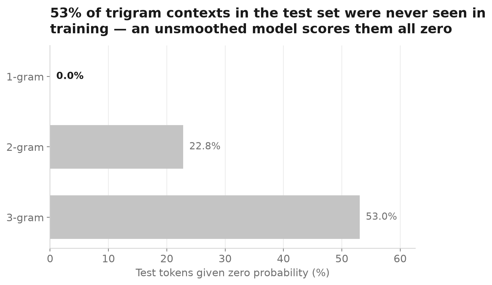
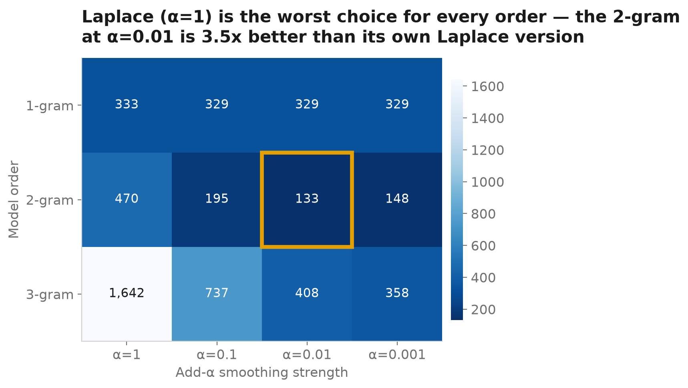
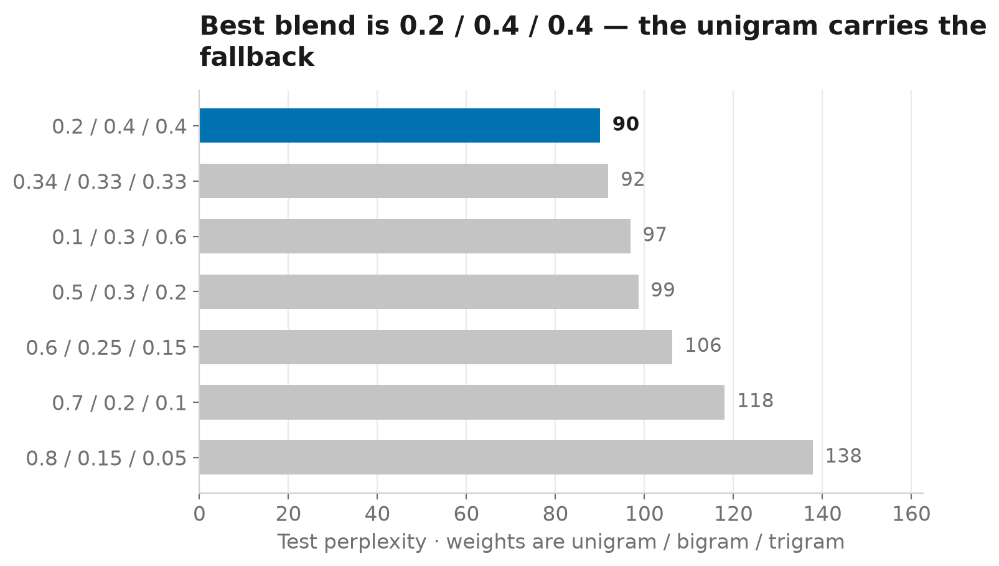
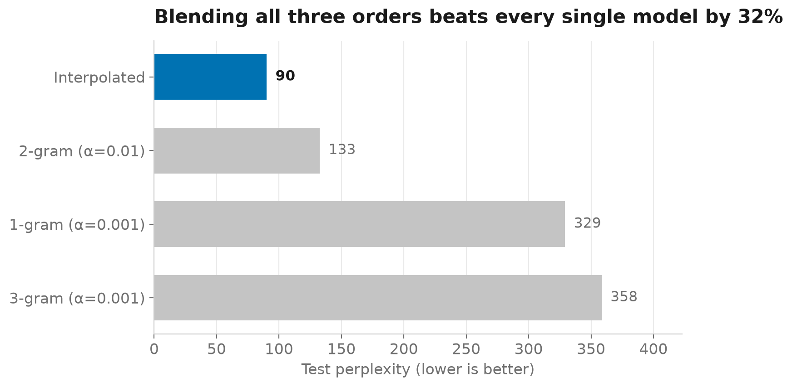

# The Textbook Fix That Made My Language Model 5× Worse

### Building an n-gram language model from scratch, and seeing what smoothing actually does

I spend most of my research time thinking about **agentic AI security**: what happens when language models are given tools, make decisions, and begin interacting with systems outside the model itself.

But the further up the stack I work, the more useful it becomes to understand what is happening underneath it.

So I started rebuilding that stack from the bottom.

**Tokens to Agents** is a seven-part series that follows the path from classical language models to modern AI agents: n-grams, embeddings, neural language modeling, transformers, LLMs and prompting, agentic AI, and finally agentic AI security.

The goal is not to avoid modern libraries. It is to understand the mechanisms they eventually abstract away.

This is **Part 1: N-grams**.

Code: GitHub `GITHUB_URL`

---

There is a standard problem you encounter almost immediately when building an n-gram language model.

Suppose the model has never seen a particular word after a particular context. The estimated probability of that event becomes zero.

And once a language model assigns zero probability to something that actually appears in the test set, its perplexity becomes infinite.

The textbook answer is usually straightforward: **add-one, or Laplace, smoothing**.

Add one to every count. Nothing has probability zero anymore. Problem solved.

Except that when I implemented it on 4,846 financial-news sentences, something unexpected happened.

My smoothed trigram model reached a perplexity of **1,642.4**.

The unigram model, which ignores context completely, scored **329.1**.

In other words, the standard fix made the trigram roughly **4.9 times worse than simply counting individual words**.

That result became the interesting part of the experiment.

N-grams are simple enough that when something goes wrong, there is nowhere for the explanation to hide. You can follow the failure all the way down to the arithmetic.

And that is a useful place to begin.

## Before language models learned representations, they counted

At its core, a language model answers a simple question:

> Given what I have seen so far, what is likely to come next?

An n-gram model answers that question by counting.

Take:

> *operating profit rose to EUR 12 million*

A trigram model might ask:

> Given **operating profit**, how often did **rose** come next?

Its estimate is simply:

```text
P(rose | operating profit)
    = count(operating profit rose)
      / count(operating profit)
```

Repeat that across a corpus and you have a language model.

There is no gradient descent here. No hidden state. No attention mechanism. No GPU training run.

The counts themselves define the probability distribution.

Modern autoregressive language models solve a much richer version of the same next-token prediction problem. What changes dramatically is how they represent context and estimate the probability of the next token.

That makes an n-gram model a useful place to meet several ideas that survive far beyond n-grams.

One of them is **perplexity**.

I compute it as the exponentiated average negative log-probability of the test tokens:

```python
def perplexity(model, sentences):
    total, count = 0.0, 0

    for p in _scored(model, sentences):
        if p <= 0.0:
            return inf

        total += log(p)
        count += 1

    return exp(-total / count)
```

One intuitive way to read perplexity is as an effective branching factor.

A model with lower perplexity is, on average, assigning more probability to the sequence that actually occurred.

There is one especially important line in that implementation:

```python
if p <= 0.0:
    return inf
```

One zero-probability event is enough to make the perplexity of the entire test set infinite.

And that is exactly what happened.

## The first problem: the model keeps seeing contexts it has never seen before

I split the dataset into 80% training and 20% testing, then built unigram, bigram, and trigram models directly from the training counts.

The result was:

* **Unigram:** 329.1
* **Bigram:** ∞
* **Trigram:** ∞



The reason becomes clear when you look at coverage.

About **22.8%** of the evaluated bigram events received zero probability.

For trigrams, that number rose to **53.0%**.

More than half of the test events were being evaluated under a trigram context for which the model had no matching evidence.

That is the central tradeoff of a simple n-gram model.

A trigram can use more context than a bigram. That should make it more informative when the relevant context has been observed.

But the additional specificity also makes exact matches much rarer.

The more specific the question becomes, the less likely the training corpus has already answered it.

So the model does not merely say:

> “I think this next word is unlikely.”

It says:

> “This next word is impossible.”

The test data immediately proves otherwise.

### Closing the vocabulary first

There is another source of zero probabilities that needs to be handled separately: words that never appeared in training.

Before training the models, I therefore create a closed vocabulary.

Words occurring below the selected frequency threshold are mapped to `<unk>`, and test-time words outside the training vocabulary are mapped there as well.

```python
counts = Counter(t for s in train for t in s)

vocab = {
    t for t, c in counts.items()
    if c >= min_count
}
```

This distinction matters.

Otherwise, the experiment would mix two different questions:

1. Has the model seen this **word** before?
2. Has the model seen this word in this particular **context** before?

I wanted to study the second.

With the vocabulary closed, the unigram has a finite perplexity. Its problem is not coverage. Its problem is that it knows nothing about context.

The higher-order models have the opposite problem.

And that brings us to smoothing.

## The textbook fix

Add-α smoothing modifies the estimate by pretending that every possible event has been observed α additional times:

```python
def prob(self, context, token):
    numerator = (
        self._ngrams[context + (token,)]
        + self.alpha
    )

    denominator = (
        self._contexts[context]
        + self.alpha * self._vocab_size
    )

    return (
        numerator / denominator
        if denominator
        else 0.0
    )
```

When α = 1, this becomes Laplace smoothing.

Now every possible next word receives some probability.

And, as expected, the infinities disappear.

| Model  | Unsmoothed | Laplace (α=1) |
| ------ | ---------: | ------------: |
| 1-gram |      329.1 |         332.6 |
| 2-gram |          ∞ |         469.6 |
| 3-gram |          ∞ |       1,642.4 |

Technically, the zero-probability problem is fixed.

But the model itself has become much worse.

The trigram reaches **1,642.4 perplexity**, almost five times the unigram.

Why?

The denominator tells most of the story.

My vocabulary contains **4,495 words**.

Under Laplace smoothing:

```text
α × V = 1 × 4,495
```

So every context effectively receives 4,495 units of additional count mass spread across the vocabulary.

Now imagine a trigram context that appeared only three times in the training data.

The observed evidence has total count 3.

Laplace smoothing asks that evidence to compete with 4,495 units introduced by the smoothing rule.

The estimate becomes dominated by the correction rather than by the data.

And trigram contexts suffer the most because they are the sparsest.

The model is not failing because using more context is inherently bad.

It is failing because the amount of smoothing is enormous relative to the amount of evidence available for many contexts.

## What happens when α is actually tuned?

The obvious next experiment was to stop assuming that α should equal 1.

I swept smaller values.



Performance improved sharply as α decreased.

The best bigram on the tested grid used:

```text
α = 0.01
```

and reached a perplexity of:

```text
132.6
```

The same bigram with α = 1 had scored:

```text
469.6
```

That is a **3.5× improvement** from changing one hyperparameter.

For this dataset, Laplace smoothing was not simply suboptimal. It was the worst smoothing strength I evaluated for every model order.

That does not make Laplace smoothing useless. It makes it a useful baseline rather than a universal setting.

The important lesson for me was more general:

**A method can solve the mathematical failure it was designed to solve while still damaging the model statistically.**

Laplace removed zero probabilities exactly as promised.

It simply redistributed far too much probability mass for this setting.

## The better answer was not choosing one model

After tuning, I had three usable models:

* unigram: **329.1**
* bigram: **132.6**
* trigram: **358.4**

The bigram was clearly the strongest single model.

But choosing only the bigram throws away something useful about the others.

A trigram can be highly informative when its context has been observed enough times.

A unigram is much less specific, but it is reliable because it does not depend on context.

That suggests a different solution: let all three contribute.

With linear interpolation:

```python
def prob(self, context, token):
    return sum(
        w * m.prob(
            context[
                len(context) - (m.n - 1):
            ] if m.n > 1 else (),
            token,
        )
        for w, m in zip(
            self.weights,
            self.models,
        )
    )
```

each model contributes part of the final probability.



The best combination I found assigned:

```text
unigram  = 0.2
bigram   = 0.4
trigram  = 0.4
```

Its perplexity was:

# **90.0**

That is about **32% lower than the best individual tuned model**.



There is something I like about this result.

The trigram had initially looked terrible. With Laplace smoothing, it scored 1,642.

But the problem was not that the trigram contained no useful information.

Once it was combined with more reliable lower-order estimates, that contextual information became useful.

Instead of asking one model to be good everywhere, interpolation lets different levels of specificity support one another.

## Where n-grams reach their limit

At this point it is natural to ask why we moved beyond n-grams at all.

The answer becomes visible in one simple example.

Suppose the training corpus contains:

> *profit rose*

and later the model encounters:

> *earnings increased*

To a count-based word-level model, those phrases have no relationship.

`profit` and `earnings` are different symbols.

`rose` and `increased` are different symbols.

Nothing in the representation tells the model that the meanings are related.

Every exact context is essentially its own island.

That is a much deeper limitation than smoothing.

Smoothing can decide how probability should be distributed when evidence is missing.

It cannot teach the model that two different words or phrases are similar.

And that is where the next part of the story begins.

Instead of representing a word only by its identity, we need a representation in which words appearing in similar contexts can share statistical information.

That is the motivation for **embeddings**.

Understanding the failure of counting makes distributed representations feel much less arbitrary.

They solve a problem that the n-gram model makes impossible to ignore.

## What survives when the models get much larger?

The implementation changes dramatically after this point, but several ideas introduced here continue through modern language modeling.

| Here                        | Later in the stack                                                                   |
| --------------------------- | ------------------------------------------------------------------------------------ |
| `P(next token \| context)`  | The autoregressive next-token objective                                              |
| Perplexity                  | A common intrinsic measure of language-model predictive performance                  |
| Limited n-gram history      | Much larger learned context representations                                          |
| Exact symbolic contexts     | Distributed representations that can share information across similar inputs         |
| `<unk>` vocabulary handling | Subword tokenization that reduces dependence on whole-word vocabularies              |
| Smoothing                   | A first example of incorporating assumptions when the observed data are insufficient |
| Interpolation               | Combining estimates with different strengths and reliability                         |

Not every analogy is exact.

A transformer is not simply a very large n-gram model, and modern neural language models do not suffer from literal unseen-context zeros in the same way.

What carries forward is the underlying statistical question:

**How should a model behave when the evidence available to it is limited?**

That question appears again and again as the models become more capable.

## And eventually, why this matters to security

This series eventually ends where my own research currently lives: agentic AI security.

I do not think an n-gram model is a miniature security model for a modern agent. The systems are far too different for that analogy to be useful.

But building this model exposes one idea that does matter later: **models have regions where their estimates are supported well by their data, and regions where they are much less reliable.**

With an unsmoothed n-gram, that boundary is unusually visible.

The model literally returns probability zero.

Smoothing removes the hard boundary, but it does not create new evidence. It introduces an assumption about what should happen where evidence is missing.

Modern language models handle uncertainty very differently, but the underlying research question remains important: how does a system behave when it encounters inputs, contexts, or interactions that differ from the situations on which its behavior was learned?

For security, those boundary cases matter because adversarial inputs are often deliberately constructed to push systems into unusual regions of their behavior.

Perplexity can sometimes be one signal of distributional unfamiliarity, although it is certainly not a security detector by itself.

Later in this series, when I move from language models to tool-using agents, this question becomes much more consequential.

A bad probability estimate produces a bad prediction.

A bad decision from an agent may trigger a tool.

That is why I wanted this series to start here.

Before worrying about how an autonomous system behaves under attack, I want to understand the machinery that eventually becomes its model.

## Reproduce the experiment

Everything in this article can be reproduced from the repository:

```bash
git clone <GITHUB_URL>
cd tokens-to-agents

uv sync
uv run python parts/01-ngrams/run.py
```

The implementation is roughly 200 lines of model code.

`run.py` recomputes the reported results and regenerates the figures used in this article.

The environment is pinned through `uv.lock` and `.python-version` so that the experiment is reproducible without manually reconstructing dependencies.

---

## Next: Embeddings

N-grams showed us exactly where counting stops being enough.

The model knows that *profit* appeared in one place and *earnings* appeared somewhere else, but it has no representation of the fact that the two words may play similar roles.

Part 2 starts there.

We will build representations that allow words to share information based on the contexts in which they occur, moving from **counts to vectors**.

And from there, one step closer to the models behind today's agents.

---

**Tokens to Agents**

**1. N-grams** → 2. Embeddings → 3. Language Modeling → 4. Transformers → 5. LLMs & Prompting → 6. Agentic AI → 7. Agentic AI Security

*Nahom M. Birhan — PhD researcher working on agentic AI security and robust AI.*

[GitHub](https://github.com/NahomMA) · [Hugging Face](https://huggingface.co/Nahom-M)
