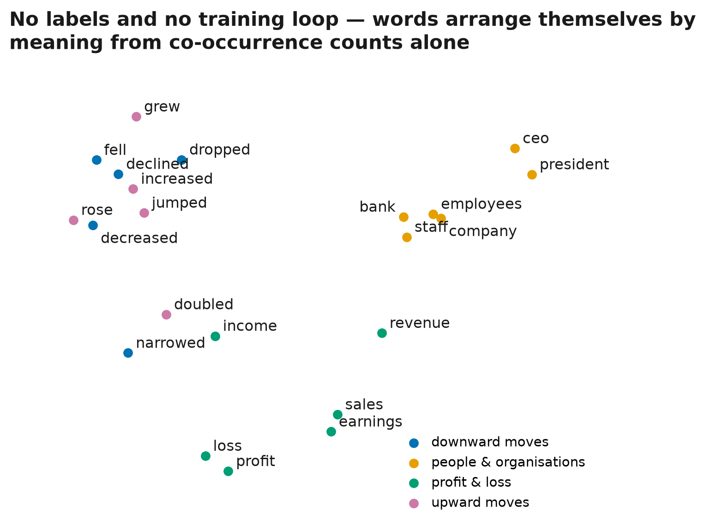

# Part 2 — Embeddings

> Part 2 of **[Tokens to Agents](../../README.md)** — building the path from classical language models to modern AI agents from first principles.
>
> 📖 Read the article on Medium — `PART2_MEDIUM_URL` · 🧭 **[Try the interactive demo](https://huggingface.co/spaces/Nahom-M/tokens-to-agents-02-embeddings)**

**Two ways to turn words into vectors, built from scratch on Part 1's corpus — and the one with no training loop wins.**

Part 1 ended on a wall: an n-gram model cannot connect *profit rose* to *earnings increased* — every context is an island. This part breaks that wall twice on the same 4,846 headlines: by **counting** (co-occurrence → PPMI → SVD, pure linear algebra) and by **predicting** (skip-gram with negative sampling, gradients derived by hand). Scored on a human-judged pair benchmark, counting wins.



## Results

4,846 sentences · 102,061 in-vocabulary tokens · vocabulary 2,360 (min count 5)

| Model | Pair AUC | Random-pair mean cosine | Build |
| --- | ---: | ---: | ---: |
| **PPMI + SVD** (counting, window 2, d=100) | **0.983** | +0.048 | ~30 s |
| Skip-gram (predicting, best of sweep: 20 epochs, window 5, d=100) | 0.918 | +0.347 | ~2 min |

The AUC asks: how often does a human-judged related pair (*profit·earnings*, *staff·employees*, …) outscore a random pair? Chance is 0.5. The skip-gram entry is the best of a five-config sweep over epochs, windows and dimensions (`run.py --sweep` reproduces it).

Three findings worth the run:

1. **The signal was in the counts all along.** Part 1's model failed because it never pooled evidence across contexts. PPMI + SVD *is* that pooling — and it resolves Part 1's zero-probability problem structurally: PMI is only computed where counts exist, and the empty cells are exactly what PPMI clips to zero.
2. **Neural is a bet on scale, not a synonym for better.** On 102k tokens the gradient-trained model drifts toward making everything resemble everything — its *random* pairs average cosine +0.35 (up to +0.71 in weaker configs), versus +0.05 for the counting model. That collapsed contrast is what the benchmark punishes.
3. **The promise from Part 1 is kept.** *rose·increased* scores 0.63 and *profit·earnings* 0.34 against a +0.05 random floor — the pairs an n-gram model could never connect are now measurably close.

## What's inside

```text
embeddings/
├── prep.py       # vocabulary and integer encoding
├── count.py      # co-occurrence → PPMI → SVD (no training loop)
├── predict.py    # skip-gram + negative sampling, gradients by hand
└── vectors.py    # WordVectors: neighbors, cosine, pair-AUC evaluation

run.py            # reproduces every number and figure; writes vectors.npz for the demo
notebook.ipynb    # the same experiment as narrative
results.json      # every published number, machine-checkable
```

No autograd anywhere. The three gradient lines in `predict.py` are the loss differentiated by hand — the same machinery Part 3 assembles into a full neural language model.

## Reproduce

```bash
# from the repository root
uv sync
uv run python parts/02-embeddings/run.py            # both final models, ~4 min
uv run python parts/02-embeddings/run.py --sweep    # adds the skip-gram tuning table
```

Figures land in `assets/images/`, numbers in `results.json`, and the demo Space's `vectors.npz` is written by the same run — article, repo and demo cannot disagree. The environment is pinned by the repository's `uv.lock` and `.python-version`.

## Data

Same corpus as Part 1: [Financial PhraseBank](https://huggingface.co/datasets/takala/financial_phrasebank) (Malo et al., 2014), `Sentences_50Agree` — 4,846 financial news sentences, downloaded on first use and cached (CC BY-NC-SA 3.0, never redistributed here). Training on the identical data is the point: it lets this part answer the question Part 1 could only pose.

## Why start the neural era with a loss?

Because the honest result *is* the lesson. Skip-gram implicitly factorises a PMI matrix (Levy & Goldberg, 2014); the explicit factorisation simply needs far less data to get there. Prediction-based learning pays off at scale — and the rest of this series is about what happens when scale arrives. The counting era ends here, and it goes out winning.

## References

The implementations in this part follow the textbook treatment in:

- Daniel Jurafsky & James H. Martin — [*Speech and Language Processing*](https://web.stanford.edu/~jurafsky/slp3/), 3rd ed. draft (2026), [Chapter 5: Embeddings](https://web.stanford.edu/~jurafsky/slp3/5.pdf) — co-occurrence vectors, PPMI with context-distribution smoothing, truncated SVD, and skip-gram with negative sampling are all implemented from this chapter's formulation.
- Omer Levy & Yoav Goldberg — [Neural Word Embedding as Implicit Matrix Factorization](https://papers.nips.cc/paper_files/paper/2014/hash/b78666971ceae55a8e87efb7cbfd9ad4-Abstract.html), NeurIPS 2014 — why the two paths are cousins, and why counting needs less data.
- Tomas Mikolov et al. — [Distributed Representations of Words and Phrases and their Compositionality](https://papers.nips.cc/paper/2013/hash/9aa42b31882ec039965f3c4923ce901b-Abstract.html), NeurIPS 2013 — the original skip-gram with negative sampling.
- Pekka Malo et al. — [Good Debt or Bad Debt](https://arxiv.org/abs/1307.5336), 2014 — the Financial PhraseBank corpus.

## Next: Part 3 — Language Modeling

The hand-derived gradients from `predict.py` get assembled into a neural next-token model: embeddings in, softmax out, every derivative on paper before it is code.

---

**[← Part 1 — N-grams](../01-ngrams)** · **[Tokens to Agents](../../README.md)** · **Next: Part 3 — Language Modeling →**
