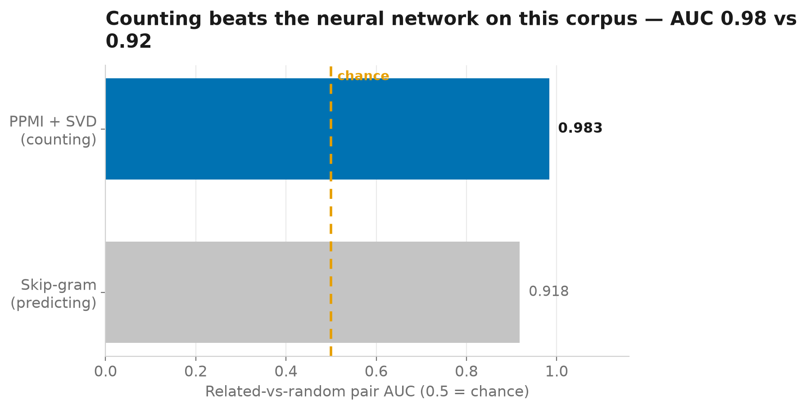
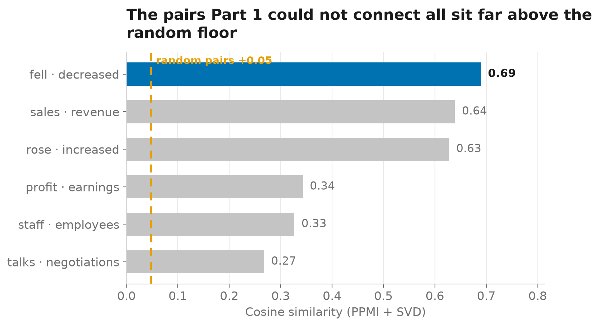

# The 1990s Method That Beat My Neural Network

### Word embeddings from scratch, two ways — and the one with no training loop wins

I spend most of my research time thinking about **agentic AI security**: what happens when language models are given tools, make decisions, and begin interacting with systems outside the model itself.

But the further up the stack I work, the more useful it becomes to understand what is happening underneath it.

So I am rebuilding that stack from the bottom.

**Tokens to Agents** is a seven-part series that follows the path from classical language models to modern AI agents: n-grams, embeddings, neural language modeling, transformers, LLMs and prompting, agentic AI, and finally agentic AI security.

This is **Part 2: Embeddings**.

Code: [github.com/NahomMA/tokens-to-agents](https://github.com/NahomMA/tokens-to-agents) · Demo: [Embedding Explorer](https://huggingface.co/spaces/Nahom-M/tokens-to-agents-02-embeddings)

---

[Part 1](https://medium.com/@nahombirhan/the-textbook-fix-that-made-my-language-model-5-worse-e8586d5639b5) ended on a wall.

An n-gram model trained on 4,846 financial headlines could compute the probability of *profit rose*. It could not conclude anything about *earnings increased* from that — not one bit of evidence transferred.

To a counting model, those phrases share nothing. Every context is an island.

This post breaks that wall on the **same corpus**, twice, with two methods built from scratch:

* **Counting.** Tally which words appear near which, keep the surprises, compress with linear algebra. No training loop exists.
* **Predicting.** Give every word a vector, use it to predict its neighbors, and correct the vectors on every mistake — skip-gram with negative sampling, gradients written by hand.

Then both methods take the same exam.

The neural one loses.

## Path 1: count, then compress

Slide a ±2-word window over the corpus and count co-occurrences. That gives every word a row of counts — already a vector, just a terrible one: dominated by frequent words and mostly zeros.

Two classical fixes, and this is the whole method.

**PPMI** keeps only co-occurrences that happen *more than chance predicts*:

```python
total = cooc.sum()
p_word = cooc.sum(axis=1) / total
ctx = cooc.sum(axis=0) ** 0.75          # context-distribution smoothing
p_ctx = ctx / ctx.sum()

rows, cols = cooc.nonzero()
pmi = np.log2(cooc[rows, cols] / total / (p_word[rows] * p_ctx[cols]))
out[rows, cols] = np.maximum(pmi, 0.0)
```

Note the `nonzero()`: PMI is only computed where a co-occurrence was observed. The zero cells that would send the logarithm to negative infinity are exactly the cells PPMI clips to zero anyway — the zero-probability problem from Part 1, dissolved instead of patched.

**SVD** then compresses the 2,360 × 2,360 PPMI matrix into 100 dense dimensions:

```python
u, s, _ = np.linalg.svd(ppmi_matrix, full_matrices=False)
vectors = u[:, :100] * np.sqrt(s[:100])
```

That is it. On this corpus it builds in about half a minute, and the result already knows things nobody told it:

```text
profit → operating, loss, pre-tax, pretax, net
rose   → fell, decreased, jumped, narrowed, totalled
```

*profit*'s neighbors are its profit-and-loss family. *rose*'s neighbors are the other movement verbs — including its own antonym, which is correct: *fell* is used in exactly the same contexts.

Project a handful of words to two dimensions and the structure is visible:


Three regions, zero labels, zero training: movement verbs, profit-and-loss terms, people and organisations.

And one detail worth staring at: within the movement region, *rose* and *fell* sit side by side. Up-words and down-words interleave, because they are used in identical contexts — *profit rose 12%*, *profit fell 12%*. Co-occurrence captures **substitutability, not polarity**. Embeddings know which words play the same role; they do not know which direction is good news. Remember that limitation — it returns when these vectors start making decisions.

## Path 2: predict, and learn from mistakes

Skip-gram flips the logic. Instead of counting what did co-occur, it *predicts* what will: each word gets a vector, and for every (center, context) pair in the corpus the model asks the center vector to score its true neighbor above a few randomly sampled impostors.

The loss for one pair with K negatives:

```text
-log σ(u_context · v_center)  -  Σₖ log σ(-u_negativeₖ · v_center)
```

Differentiate it by hand and the entire learning rule is three lines:

```python
g_pos = sigmoid(np.einsum("bd,bd->b", v_c, u_o)) - 1.0
g_neg = sigmoid(np.einsum("bd,bkd->bk", v_c, u_n))

grad_c = g_pos[:, None] * u_o + np.einsum("bk,bkd->bd", g_neg, u_n)
```

No autograd, no framework — NumPy and the chain rule. This is deliberately the same machinery Part 3 will assemble into a full language model.

## The exam

Both models produce vectors for the same 2,360 words. To score them I use twenty human-judged related pairs — *profit · earnings*, *staff · employees*, *talks · negotiations* — against 500 random pairs, and ask one question: **how often does a related pair score higher than a random one?**

That probability is an AUC. A coin flip scores 0.5. A perfect model scores 1.0.

* **PPMI + SVD (counting): 0.983**
* **Skip-gram (predicting): 0.918**



The skip-gram number is the best of a tuning sweep over epochs, window sizes and dimensions — the losing side got every advantage I could give it, and the sweep ships in the repo.

Where does the gap come from? Look at what each model says about *random* word pairs. Under PPMI + SVD, two random words score a cosine of about **+0.05** — unrelated words look unrelated. Under skip-gram, random pairs average **+0.35**, and under shorter training runs I measured floors as high as +0.7.

The gradient-trained model drifts toward making *everything* resemble everything — a known small-corpus failure of learned embeddings (the representation-collapse behind it shows up even in large models as anisotropy). The AUC punishes exactly that loss of contrast.

None of this means skip-gram is a bad algorithm. It means 102,061 tokens is not enough data for it. Levy and Goldberg showed the two paths are close cousins mathematically — skip-gram implicitly factorises a PMI matrix — but the explicit factorisation needs far less data to get there. **Neural is not a synonym for better; it is a bet on scale.**

## The promise, kept

Back to the wall Part 1 hit. Here is what the counting model says about the exact pairs an n-gram model could never connect:



*rose · increased* at 0.63, against a random floor of +0.05. *profit · earnings* at 0.34 — seven times the floor, from a word that appears only fifty times in the whole corpus.

The signal was in the counts all along. Part 1's model failed not because counting is weak, but because it never pooled evidence across contexts. An embedding is that pooling — every context a word appears in votes on where it lives in the space, and words that live in the same neighborhoods end up neighbors.

Every exact context was an island. The embedding built the bridges.

## What this has to do with security

Two things carry forward to the security work this series is walking toward.

First: **similarity is now a measurable surface.** Once *profit rose* and *earnings increased* are near-neighbors, any system that filters, retrieves or routes text by meaning inherits that geometry — including its mistakes. A safety filter that blocks a phrase but not its nearest neighbors has a measurable gap, and this post just built the instrument that measures it.

Second: **representation quality is a security property.** The skip-gram model's collapsed contrast — everything similar to everything — is precisely the failure mode that makes a similarity-based detector unreliable. Knowing *why* an embedding space has lost its contrast, and how to check, matters long before any attacker shows up.

Part 7 returns to both. For now they are just honest observations about geometry.

## Run it

```bash
git clone https://github.com/NahomMA/tokens-to-agents.git
cd tokens-to-agents

uv sync
uv run python parts/02-embeddings/run.py            # both models, ~4 minutes
uv run python parts/02-embeddings/run.py --sweep    # adds the skip-gram tuning table
```

Everything above — every number, every figure, and the vectors behind the [interactive demo](https://huggingface.co/spaces/Nahom-M/tokens-to-agents-02-embeddings) — is regenerated by that one script. The environment is pinned in a committed lockfile.

---

## Next: language modeling

The counting method won today because the task was small. But the three gradient lines in Path 2 are the seed of everything that follows: Part 3 takes the same hand-derived backpropagation and assembles it into a neural next-token model — the first machine in this series that *learns* to predict language.

The counting era ends there. It went out winning.

## References

The implementations follow the textbook treatment in **Jurafsky & Martin, [*Speech and Language Processing*](https://web.stanford.edu/~jurafsky/slp3/), 3rd ed. draft, [Chapter 5: Embeddings](https://web.stanford.edu/~jurafsky/slp3/5.pdf)** — PPMI, SVD and skip-gram with negative sampling are all built from that chapter's formulation. The counting-vs-predicting equivalence is [Levy & Goldberg, NeurIPS 2014](https://papers.nips.cc/paper_files/paper/2014/hash/b78666971ceae55a8e87efb7cbfd9ad4-Abstract.html); skip-gram itself is [Mikolov et al., NeurIPS 2013](https://papers.nips.cc/paper/2013/hash/9aa42b31882ec039965f3c4923ce901b-Abstract.html); the corpus is the Financial PhraseBank of [Malo et al., 2014](https://arxiv.org/abs/1307.5336).

---

**Tokens to Agents:** [1. N-grams](https://medium.com/@nahombirhan/the-textbook-fix-that-made-my-language-model-5-worse-e8586d5639b5) · **2. Embeddings** · 3. Language Modeling · 4. Transformers · 5. LLMs & Prompting · 6. Agentic AI · 7. Agentic AI Security

**Next: Part 3 — Language Modeling, coming soon.**

*Nahom M. Birhan — PhD student, agentic AI security.* [nahomcyberai.tech](https://nahomcyberai.tech/) · [GitHub](https://github.com/NahomMA) · [Hugging Face](https://huggingface.co/Nahom-M) · [LinkedIn](https://www.linkedin.com/in/nahombirhan)
